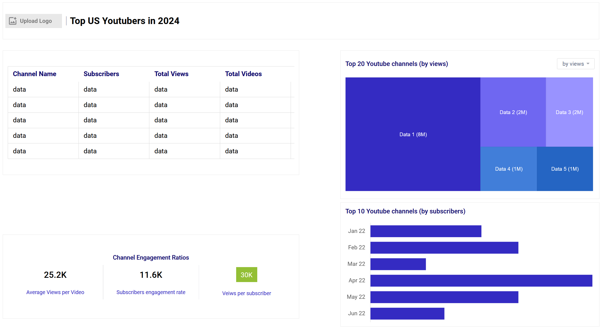
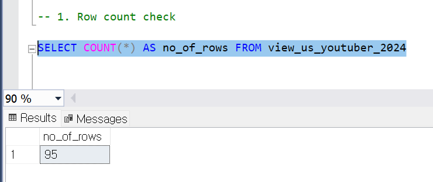
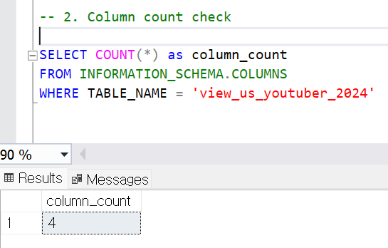
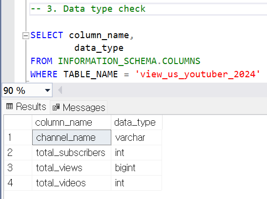
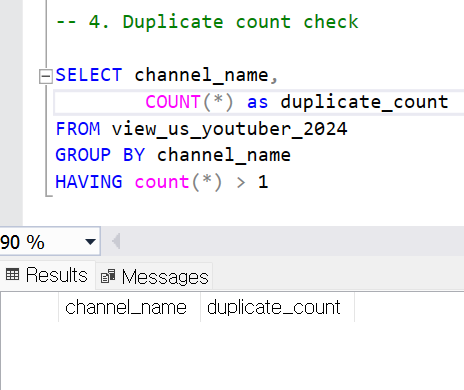
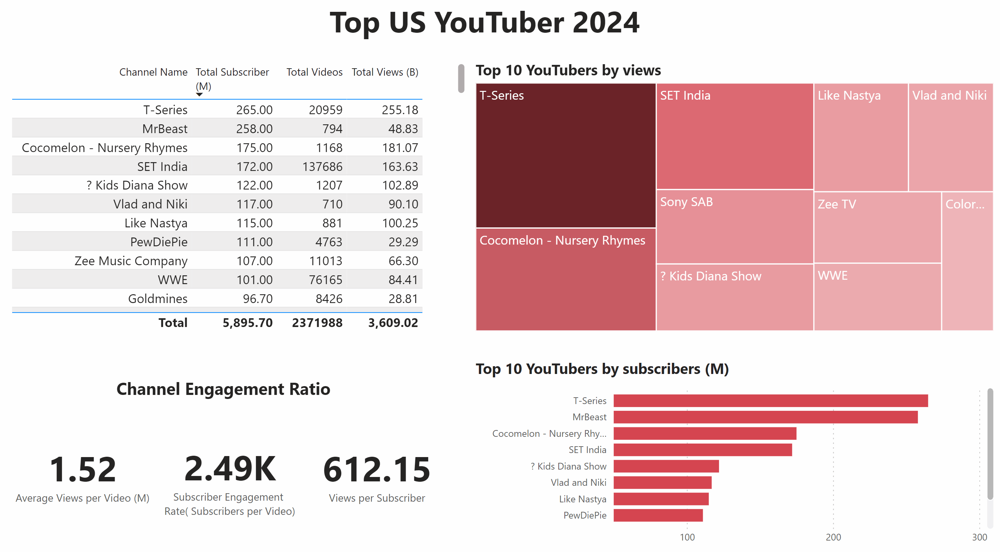

# Data Portfolio: Excel - SQL SERVER - Power BI 


# Table of contents 

- [Objective](#objective)
- [Data Source](#data-source)
- [Stages](#stages)
- [Design](#design)
  - [Mockup](#mockup)
  - [Tools](#tools)
- [Development](#development)
  - [Pseudocode](#pseudocode)
  - [Data Cleaning](#data-cleaning)
  - [Transform the Data](#transform-the-data)
- [Data quality testing](#data-quality-testing)
- [Visualization](#visualization)
  - [Results](#results)
  - [DAX Measures](#dax-measures)
- [Analysis](#analysis)
  - [Findings](#findings)
  


# Objective 

- What is the key pain point? 

I wants to find out who the top YouTubers are in 2024 to decide on which YouTubers would be best to run marketing campaigns throughout the rest of the year.


- What is the ideal solution? 

To create a dashboard that provides insights into the top US YouTubers in 2024 that includes their 
- subscriber count
- total views
- total videos, and
- engagement metrics

This will help the marketing team make informed decisions about which YouTubers to collaborate with for their marketing campaigns.


# Data source 

- What data is needed to achieve our objective?

We need data on the top UK YouTubers in 2024 that includes their 
- channel names
- total subscribers
- total views
- total videos uploaded


- Where is the data coming from? 
The data is sourced from Kaggle (an Excel extract), [see here to find it.](https://www.kaggle.com/datasets/bhavyadhingra00020/top-100-social-media-influencers-2024-countrywise?resource=download)

As Kaggle dataset does not have data for views and subscribers, I collect those data from YouTubeusing google API.


# Stages

- Design
- Developement
- Testing
- Analysis 
 


# Design 

## Dashboard components required 
- What should the dashboard contain based on the requirements provided?

To understand what it should contain, we need to figure out what questions we need the dashboard to answer:

1. Who are the top 10 YouTubers with the most subscribers?
2. Which 3 channels have uploaded the most videos?
3. Which 3 channels have the most views?
4. Which 3 channels have the highest average views per video?
5. Which 3 channels have the highest views per subscriber ratio?
6. Which 3 channels have the highest subscriber engagement rate per video uploaded?

For now, these are some of the questions we need to answer, this may change as we progress down our analysis. 


## Dashboard mockup

- What should it look like? 

Some of the data visuals that may be appropriate in answering our questions include:

1. Table
2. Treemap
3. Scorecards
4. Horizontal bar chart 





## Tools 


| Tool | Purpose |
| --- | --- |
| Python | Collecting the data |
| Excel | Exploring the data |
| SQL Server | Cleaning, testing, and analyzing the data |
| Power BI | Visualizing the data via interactive dashboards |
| GitHub | Hosting the project documentation and version control |
| Mokkup AI | Designing the wireframe/mockup of the dashboard | 


# Development

## Pseudocode

- What's the general approach in creating this solution from start to finish?

1. Get the data
2. Explore the data in Excel
3. Load the data into SQL Server
4. Clean the data with SQL
5. Test the data with SQL
6. Visualize the data in Power BI
7. Generate the findings based on the insights
8. Write the documentation + commentary
9. Publish the data to GitHub Pages


## Collecting data for TOP 100 US YouTubers in 2024

```sql

import pandas as pd
from googleapiclient.discovery import build

# Replace 'YOUR_API_KEY' with your actual YouTube Data API key
api_key = 'YOUR_API_KEY'

# Read the CSV file
csv_file = 'YOUR_DIRECTORY/YOUR_FILE.csv'
channels_df = pd.read_csv(csv_file)

# Extract channel IDs from the NAME column
channels_df['Channel ID'] = channels_df['NAME'].apply(lambda x: x.split('@')[-1])
channels_df['channel_name'] = channels_df['NAME'].apply(lambda x: x.split('@')[0])
# Build the YouTube service
youtube = build('youtube', 'v3', developerKey=api_key)

# Function to fetch channel statistics
def fetch_channel_statistics(channel_id):
    request = youtube.channels().list(
        part='snippet,contentDetails,statistics',
        id=channel_id
    )
    response = request.execute()
    if 'items' in response and len(response['items']) > 0:
        return response['items'][0]['statistics']
    else:
        print(f"No data found for channel ID: {channel_id}")
        return None

# Fetch and add statistics for each channel

channels_df['total_subscribers'] = None
channels_df['total_views'] = None
channels_df['total_videos'] = None

for idx, row in channels_df.iterrows():
    channel_id = row['Channel ID']
    stats = fetch_channel_statistics(channel_id)
    if stats:
        channels_df.at[idx, 'total_subscribers'] = stats.get('subscriberCount', 'N/A')
        channels_df.at[idx, 'total_views'] = stats.get('viewCount', 'N/A')
        channels_df.at[idx, 'total_videos'] = stats.get('videoCount', 'N/A')
    else:
        channels_df.at[idx, 'total_subscribers'] = 'N/A'
        channels_df.at[idx, 'total_views'] = 'N/A'
        channels_df.at[idx, 'total_videos'] = 'N/A'


# Save the updated dataframe to a new CSV file
output_file = 'YOUR_DIRECTORY/YOUR_OUTPUT.csv'
channels_df.to_csv(output_file, index=False)

print(f"Data has been successfully saved to {output_file}")


```

## Data cleaning 

The cleaned data should meet the following criteria and constraints:

- Only relevant columns should be retained.
- All data types should be appropriate for the contents of each column.
- No column should contain null values, indicating complete data for all records.

Below is a table outlining the constraints on our cleaned dataset:

| Property | Description |
| --- | --- |
| Number of Rows | 95 |
| Number of Columns | 4 |

And here is a tabular representation of the expected schema for the clean data:

| Column Name | Data Type | Nullable |
| --- | --- | --- |
| channel_name | VARCHAR | NO |
| total_subscribers | INTEGER | NO |
| total_views | INTEGER | NO |
| total_videos | INTEGER | NO |


- What steps are needed to clean and shape the data into the desired format?

1. Remove unnecessary columns by only selecting the ones you need
2. Extract Youtube channel names from the first column
3. Rename columns using aliases


### Transform the data 


```sql

/* 

#Data cleaning steps

1. Remove unnecessary columns by only selecting the ones we need
2. Extract the YouTube channel names from the first columns
3. Rename the column names 
4. Handling null values
5. Create a view

*/


-- Handling null values
/*
Given that multiple rows have null values across all key columns 
(total_subscribers, total_views, total_videos),
it is best to handle these rows by deleting them, 
as they do not provide any useful information for your analysis.
In this project, creating a view that filters out rows with null values
is a great alternative and storage saving method.


--1.total number of null values in each columns 
SELECT
	SUM(CASE WHEN total_subscribers IS NULL THEN 1 ELSE 0 END) AS NULL_NUM_total_subscribers,
	SUM(CASE WHEN total_views IS NULL THEN 1 ELSE 0 END) AS NULL_NUM_total_views,
	SUM(CASE WHEN total_videos IS NULL THEN 1 ELSE 0 END) AS NULL_NUM_total_videos

FROM top_us_youtuber__20204 


--2. check if each row has multiple null values
SELECT
	CAST(TRIM(SUBSTRING(NAME, 1, CHARINDEX('@',NAME,1)-1)) AS VARCHAR(100)) ChannelName,
	total_subscribers, 
	total_views,
	total_videos
FROM top_us_youtuber__20204
WHERE total_videos is null
*/

--3.creating a view to filter out null values
CREATE VIEW view_us_youtuber_2024 AS
SELECT
	CAST(TRIM(SUBSTRING(NAME, 1, CHARINDEX('@',NAME,1)-1)) AS VARCHAR(100)) channel_name,
	total_subscribers, 
	total_views,
	total_videos
FROM top_us_youtuber__20204
WHERE 
	total_subscribers is not null 
	AND total_views is not null 
	AND total_videos is not null 


```


# Data quality testing

- What data quality and validation checks are you going to create?

Here are the data quality tests conducted:


## Row count check
### SQL query
```sql
/*
# Count the total number of records (or rows) are in the SQL view
*/

SELECT
    COUNT(*) AS no_of_rows
FROM
    view_us_youtuber_2024;

```

### Output 



## Column count check
### SQL query 
```sql
/*
# Count the total number of columns (or fields) are in the SQL view
*/


SELECT
    COUNT(*) AS column_count
FROM
    INFORMATION_SCHEMA.COLUMNS
WHERE
    TABLE_NAME = 'view_us_youtuber_2024'
```
### Output 



## Data type check
### SQL query 
```sql
/*
# Check the data types of each column from the view by checking the INFORMATION SCHEMA view
*/

-- 1.
SELECT
    COLUMN_NAME,
    DATA_TYPE
FROM
    INFORMATION_SCHEMA.COLUMNS
WHERE
    TABLE_NAME = 'view_us_youtuber_2024';
```
### Output



## Duplicate count check
### SQL query 
```sql
/*
# 1. Check for duplicate rows in the view
# 2. Group by the channel name
# 3. Filter for groups with more than one row
*/

-- 1.
SELECT
    channel_name,
    COUNT(*) AS duplicate_count
FROM
    view_us_youtuber_2024

-- 2.
GROUP BY
    channel_name

-- 3.
HAVING
    COUNT(*) > 1;
```
### Output



# Visualization 


## Results

- What does the dashboard look like?



This shows the Top UK Youtubers in 2024 so far. 


## DAX Measures

### 1. Total Subscribers (M)
```sql
Total Subscribers (M) = 
VAR million = 1000000
VAR sumOfSubscribers = SUM(view_us_youtuber_2024[total_subscribers])
VAR totalSubscribers = DIVIDE(sumOfSubscribers,million)

RETURN totalSubscribers

```

### 2. Total Views (B)
```sql
Total Views (B) = 
VAR billion = 1000000000
VAR sumOfTotalViews = SUM(view_us_youtuber_2024[total_views])
VAR totalViews = ROUND(sumOfTotalViews / billion, 2)

RETURN totalViews

```

### 3. Total Videos
```sql
Total Videos = 
VAR totalVideos = SUM(view_us_youtuber_2024[total_videos])

RETURN totalVideos

```

### 4. Average Views Per Video (M)
```sql
Average Views per Video (M) = 
VAR sumOfTotalViews = SUM(view_us_youtuber_2024[total_views])
VAR sumOfTotalVideos = SUM(view_us_youtuber_2024[total_videos])
VAR  avgViewsPerVideo = DIVIDE(sumOfTotalViews,sumOfTotalVideos, BLANK())
VAR finalAvgViewsPerVideo = DIVIDE(avgViewsPerVideo, 1000000, BLANK())

RETURN finalAvgViewsPerVideo 

```


### 5. Subscriber Engagement Rate
```sql
Subscriber Engagement Rate = 
VAR sumOfTotalSubscribers = SUM(view_us_youtuber_2024[total_subscribers])
VAR sumOfTotalVideos = SUM(view_us_youtuber_2024[total_videos])
VAR subscriberEngRate = DIVIDE(sumOfTotalSubscribers, sumOfTotalVideos, BLANK())

RETURN subscriberEngRate 

```


### 6. Views per subscriber
```sql
Views Per Subscriber = 
VAR sumOfTotalViews = SUM(view_us_youtuber_2024[total_views])
VAR sumOfTotalSubscribers = SUM(view_us_youtuber_2024[total_subscribers])
VAR viewsPerSubscriber = DIVIDE(sumOfTotalViews, sumOfTotalSubscribers, BLANK())

RETURN viewsPerSubscriber 

```


# Analysis 

## Purpose of the Analysis

The purpose of this analysis is to determine the most profitable YouTube channel for advertising investment based on key metrics that indicate both reach and engagement. By analyzing various metrics, we aim to identify the channel that will maximize the exposure of advertisements to the largest and most engaged audience possible.


## Findings

For this analysis, we focused on the following questions to gather the necessary information for our marketing client:

### 1. Who are the top 10 YouTubers with the most subscribers?

| Rank | Channel Name         | Subscribers (M) |
|------|----------------------|-----------------|
| 1    | T-Series             | 265.00          |
| 2    | MrBeast              | 258.00          |
| 3    | Cocomelon            | 175.00          |
| 4    | SET India            | 172.00          |
| 5    | Kids Diana Show      | 122.00          |
| 6    | Vlad and Niki        | 117.00          |
| 7    | Like Nastya          | 115.00          |
| 8    | PewDiePie            | 111.00          |
| 9    | Zee Music Company    | 107.00          |
| 10   | WWE                  | 101.00          |

### 2. Which 3 channels have uploaded the most videos?

| Rank | Channel Name    | Videos Uploaded |
|------|-----------------|-----------------|
| 1    | VBP NEWS        | 374,011         |
| 2    | Aaj Tak         | 369,577         |
| 3    | ABS-CBN         | 223,626         |

### 3. Which 3 channels have the most views?

| Rank | Channel Name | Total Views (B) |
|------|--------------|-----------------|
| 1    | T-Series     | 255.18          |
| 2    | Cocomelon    | 181.07          |
| 3    | SET India    | 163.63          |

### 4. Which 3 channels have the highest average views per video?

| Rank | Channel Name             | Average Views per Video (M) |
|------|--------------------------|-----------------------------|
| 1    | Cocomelon - Nursery Rhymes | 155.02                      |
| 2    | MrBeast                  | 61.50                       |
| 3    | T-Series                 | 12.18                       |

### 5. Which 3 channels have the highest views per subscriber ratio?

| Rank | Channel Name             | Views per Subscriber        |
|------|--------------------------|-----------------------------|
| 1    | Cocomelon - Nursery Rhymes | 1.03K                       |
| 2    | T-Series                 | 962.94                      |
| 3    | MrBeast                  | 189.27                      |

### 6. Which 3 channels have the highest subscriber engagement rate per video uploaded?

| Rank | Channel Name    | Subscriber Engagement Rate (Subscribers per Video) |
|------|-----------------|---------------------------------------------------|
| 1    | MrBeast         | 324.94K                                           |
| 2    | Cocomelon - Nursery Rhymes | 149.83K                                   |
| 3    | T-Series        | 12.64K                                            |

## Analysis of Key Metrics

After answering the above questions, we found that different channels excelled in different metrics. This variability made it difficult to make a clear decision based on these six metrics alone. Therefore, we decided to prioritize three key metrics that would have the biggest impact on advertising effectiveness:

1. **Total Subscribers**: Indicates the core potential audience.
2. **Subscribers per Video**: Indicates consistent engagement with each video.
3. **Views per Video**: Demonstrates the overall reach of the videos.

### Relative Scoring System

Each channel will be scored from 0 to 10 for each key metric, where the score is normalized based on the range of values for that metric. The total score will determine the overall ranking.

#### 1. Total Subscribers

| Channel Name        | Subscribers (M) | Relative Score |
|---------------------|-----------------|----------------|
| T-Series            | 265.00          | 10.0           |
| MrBeast             | 258.00          | 9.7            |
| Cocomelon           | 175.00          | 6.6            |

#### 2. Subscribers per Video

| Channel Name                 | Subscribers per Video | Relative Score |
|------------------------------|-----------------------|----------------|
| MrBeast                      | 324.94K               | 10.0           |
| Cocomelon - Nursery Rhymes   | 149.83K               | 4.6            |
| T-Series                     | 12.64K                | 0.4            |

#### 3. Views per Video

| Channel Name                 | Average Views per Video (M) | Relative Score |
|------------------------------|-----------------------------|----------------|
| Cocomelon - Nursery Rhymes   | 155.02                      | 10.0           |
| MrBeast                      | 61.50                       | 4.0            |
| T-Series                     | 12.18                       | 0.8            |

### Total Scores

| Channel Name                 | Total Subscribers | Subscribers per Video | Views per Video | Total Score |
|------------------------------|-------------------|-----------------------|-----------------|-------------|
| T-Series                     | 10.0              | 0.4                   | 0.8             | 11.2        |
| MrBeast                      | 9.7               | 10.0                  | 4.0             | 23.7        |
| Cocomelon - Nursery Rhymes   | 6.6               | 4.6                   | 10.0            | 21.2        |

## Final Recommendation

**Based on the total scores from the key metrics**:
- **Primary Choice: MrBeast**: With the highest total score, MrBeast offers a balanced high subscriber base and very high engagement per video, making it ideal for broad, impactful campaigns.
- **Secondary Choice: Cocomelon - Nursery Rhymes**: With a strong score and the highest views per video, this channel is optimal for ensuring your ads are seen by a large, engaged audience, especially families and children.

### Detailed Recommendation

**Primary Choice: MrBeast**
- **High Total Subscribers**: Ensures a broad reach.
- **High Subscribers per Video**: Indicates strong engagement from subscribers.
- **Substantial Views per Video**: Ensures significant overall reach.

**Secondary Choice: Cocomelon - Nursery Rhymes**
- **Highest Views per Video**: Ensures maximum visibility per video.
- **Moderate Subscribers per Video**: Indicates good engagement.
- **Lower Total Subscribers**: Compensated by the high views per video.

These recommendations align with your priorities, ensuring that your advertisements reach the maximum audience with the highest engagement possible.


